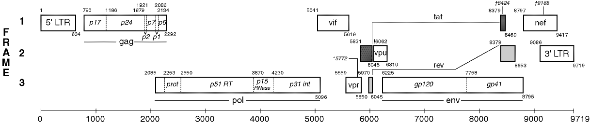

```{r setup, include=FALSE}
# packages required for this post
local({
  pkgs <- c(
    "dplyr",
    "readr",
    "stringr",
    "tidyr",
    "ggplot2",
    "forcats",
    "knitr",
    "kableExtra",
    "maptools",
    "viridis",
    "RColorBrewer",
    "mapproj",
    "broom",
    "ggrepel",
    "sf"
  )
  
  not_installed <- setdiff(pkgs, as.data.frame(installed.packages())$Package)
  if (length(not_installed)) {
    install.packages(not_installed)
  }
})

knitr::opts_chunk$set(echo = TRUE)
```

*Phillip (Armand) Bester is a medical scientist, researcher and lecturer at the [Division of Virology](https://www.ufs.ac.za/health/departments-and-divisions/virology-home), [University of the Free State](https://www.ufs.ac.za) and [National Health Laboratory Service (NHLS)](http://www.nhls.ac.za/), Bloemfontein, South Africa*

*Sabeehah Vawda is a pathologist, researcher and lecturer at the [Division of Virology](https://www.ufs.ac.za/health/departments-and-divisions/virology-home), [University of the Free State](https://www.ufs.ac.za) and [National Health Laboratory Service (NHLS)](http://www.nhls.ac.za/), Bloemfontein, South Africa*

*Andrie de Vries is author of "R for Dummies" and Solutions Engineer at RStudio*


## Introduction

The [Human Immunodifciency Virus](https://www.immunology.org/public-information/bitesized-immunology/pathogens-and-disease/human-immunodeficiency-virus-hiv) (**HIV**) is the virus that causes acquired immunodeficiency syndrome (**AIDS**).  The virus invades various immune cells, causing loss of immunity, and thus increased susceptibility to infections, including Tuberculosis and cancer.

In a recent publication in [PLoS ONE](https://journals.plos.org/plosone/article?id=10.1371/journal.pone.0213241) the authors described how they used affordable hardware to create a [phylogenetic](https://en.wikipedia.org/wiki/Phylogenetics) pipeline, tailored for the HIV drug resistance testing facility.

In this series of blog posts we highlight the serious problem of HIV infection in sub-Saharan Africa, with special analysis of the situation in South Africa.


### Stages of HIV infection

HIV infection can be divided into the three consecutive stages, acute primary infection, asymptomatic stage and the symptomatic stage.

The first stage, **acute primary infection**, has symptoms very much like flu and may last for a week or two.  The body reacts with an immune response which results in the production of antibodies to fight the HIV infection.  This process is called seroconversion and can last a couple of months.  During this stage, although the patient is infected and the virus is spreading through the body, the patient might not test positive.  This initial period of seroconversion is called 'the window period' and depends on the type of test used.  Rapid tests are done at the point of care.  This means that the test can be done at the clinic with a finger prick and the result is ready in 20 minutes.  The drawback of this test is a window period of three months and a small false positive rate.  The rapid test detects HIV antibodies and because the immune system needs some time to produce sufficient antibodies to be detected there is this window period.  Most laboratories these days use fourth generation [ELISA](https://www.immunology.org/public-information/bitesized-immunology/experimental-techniques/enzyme-linked-immunosorbent-assay) (Enzyme-Linked Immunosorbent Assay) for HIV diagnosis and confirmation.  This technique detects both HIV antibodies and antigens.  Antigens are the foreign objects which the immune system recognizes as 'non-self' and in this case, it is the viral protein p24.  The advantage of this technique is a window period of only one month. 


This first stage which includes the window period is then followed by the **asymptomatic stage** and this may last for as long as ten years.  During this stage, the infected person does not experience symptoms and feels healthy.  However, the virus is still replicating and destroying immune cells, especially CD4 cells.  This damages the immune system and ultimately leads to stage 3 if not treated.  This does not mean that people at stage 3 are doomed, but the earlier treatment starts the better the outcome.

Stage 3 is referred to as **symptomatic HIV infection or AIDS** (Acquired Immune Deficiency Syndrome).  At this stage, the immune system is so weak that it is not able to fight off bacterial or fungal infections which typically do not cause infections in immune competent people.  These serious infections are called opportunistic infections and have a high morbidity and mortality rate.

### Transmission and epidemiology

Worldwide, approximately 36.9 million (UNAIDS) people are living with HIV. 

HIV is transmitted mainly by:

- Having unprotected sex.
- Non-sterile needles in drug use or sharing needles.
- Mother to child transmission during birth or breastfeeding.
- Infected blood transfusions, transplants or other medical procedures. However, this is very unlikely.


We mentioned the window period of the HIV infection as well as the asymptomatic stage.  During any of the stages, it is possible to transmit the infection.  The problem with the window period is an unknown HIV status or falsely assumed negative status and during the asymptomatic stage, there is no reason for the infected person to seek medical attention.  There are obviously behavioural issues in HIV transmission and due to the long asymptomatic phase HIV positive status can be unknown for a long period.  For these reasons, it is important that high-risk individuals do frequent HIV tests to determine their status.

### Treatment for HIV infection

HIV is treatable but not (yet) curable. The good news, however, is that if a person receives **antiretroviral (ARV) treatment**, their viral load suppresses (viral replication stops) and the chance of transmitting HIV drastically decreases.

So 30 years into this pandemic, the big question is, why is HIV still a problem?

Not all countries adopted the use of ARVs in an equal manner.  Although AZT (Zidovudine) was the first drug to be approved by the [FDA](https://www.fda.gov/forpatients/illness/hivaids/history/ucm151074.htm) in March 1987, it was soon discovered that monotherapy with only AZT was not effective for very long as the virus developed resistance to the medicine quickly.  Since then ARVs have come a long way and patients are placed on:

- **HAART** (Highly Active Antiretroviral Treatment), or 
- **cART** (combination Antiretroviral Treatment) which typically consists of 3 drugs of different classes.  

## HIV in Africa

Let's look at the rates of HIV infection in different African countries. The world factbook by the CIA has some HIV infection rate [data](https://www.cia.gov/LIBRARY/publications/the-world-factbook/rankorder/rawdata_2155.txt).

```{r load}
suppressPackageStartupMessages({
  library(dplyr)
  library(readr)
  library(stringr)
  library(tidyr)
  library(ggplot2)
  library(forcats)
  library(knitr)
  library(kableExtra)
  library(maptools)
  library(viridis)
  library(RColorBrewer)
  library(mapproj)
  library(broom)
  library(ggrepel)
  library(sf)
})
```


```{r plot_map}
# read the HIV data
HIV_rate_2016 <- read_csv("HIV rates.csv", col_names = TRUE, col_types = "cd")

# read the Africa shape file
africa <-
  sf::st_read("Africa_SHP/Africa.shp", stringsAsFactors = FALSE, quiet = TRUE) %>%
  rename(Country = "COUNTRY") %>%
  left_join(HIV_rate_2016, by = "Country")

africa %>%
  ggplot(aes(fill = Rate)) +
  geom_sf() +
  coord_sf() +
  scale_fill_viridis(option = "plasma") +
  theme_minimal()
```

In the choropleth above we see that South Africa, Botswana, Lesotho and Swaziland seem to have the highest rates of infection. This is presented as the percentage infected which takes into account population sizes. It is important to understand that the level of denial is indirectly proportional to the reported rate of infection. Even in this day and age denial of stigmatized diseases is an issue.


### Cleaning the data

We can also look at the burden of HIV as the number of people infected and we might get a different picture from what we saw from the choropleth.

Read in the [data](http://apps.who.int/gho/data/node.main.626), and rename the columns to `Country`, `PersCov` (percentage ARV coverage), `NumberOnARV` (Number of patients on ARVs) and `NumberInfected` (Number of patients infected).


```{r import}
# Read csv with ARV infection dat
arv_dat <- read_csv(
  "ARV cov 2017.csv", 
  col_types = "cccc",
  col_names = c("Country", "PersCov", "NumberOnARV", "NumberInfected"),
  skip = 1
)

head(arv_dat)
```


This data has several symptoms of being very messy:

- Very long variable names, descriptive, but difficult to work with, this was changed during import
- The values contain confidence intervals in brackets, this will be difficult to work with as is
- We might want to transform no data to `NA`
- We are interested in Sub-Saharan Africa, but the data is for the whole world

```{r clean}
# A list of Sub-Saharan countries
sub_sahara <- readLines("Sub-Saharan.txt")

clean_column <- function(x){
  # Remove the ranges in brackets and convert the values to numeric
  x %>% 
    str_replace_all("\\[.*?\\]", "") %>% 
    str_replace_all("<", "") %>%
    str_replace_all(" ", "") %>% 
    as.numeric()
}

arv_dat <- 
  arv_dat %>% 
  filter(Country %in% sub_sahara) %>% 
  na_if("No data") %>% 
  mutate_at(2:4, clean_column)

head(arv_dat)
```

We use a regular expression to get rid of all the square bracket ranges.  We also remove the "<" sign and spaces within numbers, change "No data" to `NA` and convert the characters to numbers. We filter out the countries we don't want.  (Note some countries are not available in the ARV data, e.g. Swaziland and Reunion.)


### Highest infected countries

Now look at the countries with the highest number of infected people of all ages.

```{r highest}
arv_dat %>% 
  top_n(4, wt = NumberInfected) %>% 
  arrange(-NumberInfected) %>% 
  kable(
    format = "html", 
    caption = "Countries with the highest number of HIV infections"
  ) %>% 
  kable_styling(bootstrap_options = c("striped", "hover"))
```

We can see that South Africa has the highest number of HIV infected people in Sub-Saharan Africa.


## HIV in Southern Africa

In South Africa, the first AIDS-related death occurred in 1985. Not all patients were eligible to receive ARVs and it was only in 2004 that ARVs became available in the public sector in South Africa. Eligibility restriction still applied so not all HIV infected patients received treatment.

Ideally, a country would have all it’s HIV infected people on treatment, but due to financial constraints, this is not always possible. In South Africa patients where only initialized on ARVs when their CD4 counts dropped below a certain level. This threshold was initially 200 cells/mL in 2004 which was then changed to 350 cells/mL and 500 cell/mL at later intervals. These recommendations were a compromise between the availability of funds and getting ARVs to the people needing it the most. CD4 cells are a major component of the immune system; the lower the CD4 cell count the higher the chance for opportunistic infections. Thus, the idea is to support the patients who are most likely to contract an opportunistic infection.

The problem with this was that about only a third of the HIV infected people in South Africa were receiving HAART treatment. In 2017 the guidelines changed to test and treat, i.e. any newly diagnosed patient will receive HAART treatment. This is a big improvement for many reasons, but notably a lower infection rate. If a patient is taking HAART treatment and it is effective in suppressing the viral replication, the chances of the patient transmitting the virus are very close to zero.

However, these treatments are not without side effects, which in some cases causes very poor adherence to the treatment. There are numerous factors to blame here, specifically socio-economic factors and depression. There is also ignorance and the "fear of knowing" which causes people not to know their status. Finally, human nature brings with it various other complexities such as conspiracy theories, religious and personal beliefs. This will be a very long post if we delve into all the issues, the take home message: the situation is complicated.

### ARV coverage by country

We looked at the rate of HIV infections and also the number of people infected in the most endemic countries. We have talked about treatment.  It would be interesting to look at ARV coverage by country.

Let's see how these countries rank by ARV coverage:

```{r plot_rank, fig.width=8, fig.height=6}
arv_dat %>%
  na.omit(PersCov) %>%
  ggplot(aes(x = reorder(Country, PersCov), y = PersCov)) +
  geom_point(aes(colour = NumberInfected), size = 3) +
  scale_colour_viridis(
    name = "Number of people infected", 
    trans = "log10",
    option = "plasma"
  ) +
  coord_flip() +
  ylab("% ARV coverage") + xlab("Country") +
  theme_bw()
```


This shows that Zimbabwe, Namibia, Botswana and Rwanda have the highest ARV coverage (above 80%).  South Africa has the highest number of infections as (we saw this before) and coverage of just above 60%.

Botswana rolled out their treatment program in 2002 and by mid-2005 about half of the eligible population received ARV treatment.  South Africa, on the other hand, only started treatment in 2004, which we discuss later.

When talking about treatment, we should also look at the changes in mortality.


### HIV related deaths

Read in the [data](http://apps.who.int/gho/data/node.main.623?lang=en):

```{r hiv_mort}
hiv_mort <- 
  read_csv("HIV deaths.csv", col_types = "ccccc") %>% 
  na_if("No data") %>% 
  mutate_at(vars(starts_with("Deaths")), clean_column) %>% 
  filter(Country %in% sub_sahara)

head(hiv_mort)
```

```{r}
summary(hiv_mort)
```

The 2017 mean for the dataset as a whole is about half of that during the early 2000s.  It would be interesting to plot this data, but it will probably be too busy as it is.  We can rather have a look at countries which had the most change.

```{r hiv_mort_change}
hiv_mort <- hiv_mort %>% 
  mutate(
    min = apply(hiv_mort[, 2:4], 1, FUN = min),
    max  = apply(hiv_mort[, 2:4], 1, FUN = max),
    Change = max - min
  )
```


Next, we can create a plot of the data and look at the top 5 countries with the biggest change in HIV related mortality.


```{r plot_hiv_mort}
hiv_mort %>%
  top_n(5, wt = Change) %>%
  gather(Year, Deaths, Deaths_2017:Deaths_2000) %>% 
  na.omit() %>%
  mutate(
    Year = str_replace(Year, "Deaths_", "") %>% as.numeric(),
    Country = fct_reorder(Country, Deaths)
  ) %>% 
  ggplot(aes(x = Year, y = Deaths, color = Country)) +
  geom_line(size = 1) +
  geom_vline(xintercept = 2004, color = "black", linetype = "dotted", size = 1.5) +
  scale_color_viridis(option = "D", discrete = TRUE) +
  theme_bw() +
  theme(legend.position = "bottom")  
```

Remember we mentioned that **HAART** (Highly Active Antiretroviral Treatment) was introduced in 2004 in South Africa, depicted here by the black dotted line.  It is easy to appreciate the dramatic effect the introduction of ARVs had in South Africa. 

Although the picture above is positive, the fight is not over.  The target is to get at least 90% of HIV infected patients on treatment.  Adherence to ARV regimens stays crucial not only to suppress viral replication but also to minimize the development of drug resistance. 


### Infection rates


As mentioned earlier, if a patient is taking and responding to treatment, the viral load gets suppressed and the chances of transmitting the infection become very close to null.  Thus the more patients with an undetectable viral load the lower the transmission rate.

Read the [data](http://aidsinfo.unaids.org/?did=5b4eaa7cdddb54192bb39714&r=world&t=null&tb=d&bt=dnli&ts=null&tr=world&tl=2):

```{r new_infections, warn = FALSE}
new_infections <- 
  read_csv(
    "Epidemic transition metrics_Trend of new HIV infections.csv", 
    na = "...", 
    col_types = cols(
      .default = col_character(),
      `2017_1` = col_double()
    )
  ) %>% 
  select(
    -ends_with("_upper"), 
    -ends_with("lower"), 
    -ends_with("_1")
  ) %>% 
  mutate_at(-1, clean_column) %>%
  na.omit()


new_infections %>% 
  gather(Year, NewInfections, 2:9) %>% 
  ggplot(aes(x = Year, y = NewInfections, color = Country)) +
  geom_point() +
  theme_classic() +
  theme(legend.position = "none") +
  xlab("Year") + 
  ylab("Number of new infections")
```

This is a bit busy.  Countries which are highly endemic with good ARV coverage and prevention of infection programs should have a steeper decline in the newly infected people.  At first glance, it looks like some of the data points are fairly linear.  Let's go with that assumption and apply linear regression to each country.


```{r rates_model, warning=FALSE}
rates_modeled <- 
  new_infections %>% 
  filter(Country %in% sub_sahara) %>% 
  na.omit() %>% 
  gather(Year, NewInfections, 2:9) %>% 
  mutate(Year = as.numeric(Year)) %>% 
  group_by(Country) %>% 
  do(tidy(lm(NewInfections ~ Year, data = .))) %>% 
  filter(term == "Year") %>% 
  ungroup() %>% 
  mutate(
    p.Interpreted = ifelse(p.value <= 0.05, "significant", "insignificant"),
    Country = fct_reorder(Country, estimate, .desc = TRUE)
  ) %>% 
  arrange(desc(estimate))

head(rates_modeled) %>% 
  kable(
    format = "html", 
    caption = "Results of linear regression: Rate of new infections per year"
  ) %>% 
  kable_styling(bootstrap_options = c("striped", "hover"))
```

```{r rates_model_plot}
rates_modeled %>%
  na.omit() %>% 
  ggplot(aes(x = Country, y = estimate, fill = p.Interpreted)) +
  geom_col() +
  coord_flip() +
  theme_bw() +
  ylab("Extimated change in HIV infection (people/year)")

```

A quick look at the plot shown above we can see that for most countries a linear model fits the data with a significant p-value cutoff of 0.05.  It is important to note here that the data we have at hand is from 2010 to 2017.

This shows that some countries notably, South Africa, are on a good trajectory.  Botswana, being the "Poster Child" of a good HIV treatment and prevention program, seems to have stabilized in terms of rate of infection with a positive but insignificant estimate of the rate of infection.  This could be explained by the following reasons:

- First African country to introduce HAART, 2002
- Progressive in terms of prevention programs
- Only looking from 2010, we are missing the dramatic decline in infection
- The WHO goal is to get 90% of a country's infected people on HAART, but the last 5-7% might be the hardest to convince

We can combine the ARV and estimated rates of infection data.

```{r arv_infection}
arv_on_infection <- left_join(arv_dat, rates_modeled, by = "Country")

arv_on_infection %>% 
  na.omit() %>% 
  ggplot(aes(x = PersCov, y = estimate, 
             shape = p.Interpreted)) +
  geom_point(aes(color = NumberInfected), size = 2) +
  geom_text_repel(aes(label = Country), size = 3) +
  scale_color_gradient(high = "red", low = "blue") +
  theme_grey() +
  xlab("% ARV coverage") + 
  ylab("Estimated change in HIV infection\n(people/year)") +
  ggtitle("Antiretroviral (ARV) coverage")

```


South Africa has the highest number of infected people, but on the positive side has a downward trajectory of about 15000 fewer people newly infected each year.  Although ARVs do play a crucial role in controlling this epidemic it is not the only factor involved.  Prevention from mother to child transmission has been very successful in South Africa.  Awareness campaigns and education are playing a big role as well.  The plot above shows our linearly modelled rates.  


## The laboratory, HIV diagnosis and monitoring

HIV related laboratory tests are not the only diagnostics done in a Virology department, but in endemic countries, it accounts for the majority of tests which are done.  The first HIV related test done would be for diagnosis.  This is done differently in adults than in infants.  As we discussed earlier, after HIV infection the immune system develops antibodies. We can use a field of study called **serology** to detect antibodies and antigens and in most cases, an ELISA test is performed to confirm HIV seroconversion or status.  Since the mother's antibodies will be present in the infant an ELISA will tell us the baby is positive even though not infected.  Infants are diagnosed by detecting viral RNA or DNA in their blood.  This is done by PCR (Polymerase Chain Reaction).

Once a patient is diagnosed as HIV positive, the patient will be initiated on HAART and in most cases the viral load will be suppressed.  In the South African public sector treatment program, after HAART initiation, the patient gets two six-monthly viral load tests to make sure viral replication is suppressed.  To keep an eye out for trouble a yearly viral load is done to confirm adherence and effectiveness of the treatment.

When an unsuppressed viral load is detected action is taken and adherence counselling is performed.  If this does not solve the problem drug resistance testing is performed to assess the resistance profile of the infection in order to adjust the ARV regimen accordingly. This is done by isolating the viral RNA, converting it to DNA, amplifying the DNA to sufficient quantities to enable sequencing of the DNA.  In our laboratory, we use [Sanger sequencing](https://en.wikipedia.org/wiki/Sanger_sequencing), but other sequencing technologies also exist.

---

```{r sanger_diagram, echo=FALSE, fig.cap="HIV Genome as depicted by the Los Alamos HIV sequence database. Available at https://www.hiv.lanl.gov/content/sequence/HIV/MAP/landmark.html", out.extra='style="margin:50px 10px"', fig.align="center"}
 
```

---

This diagram depicts the genome of HIV.  The most common targets for interfering with viral replication is located in the *pol* gene. Specifically:


- **prot**:  The viral protease.  Many of the viral proteins are translated as longer polypeptides which are then cleaved into mature proteins by the protease.

- **p51 RT**: The viral reverse transcriptase:  Each virion contains two copies of viral RNA.  The reverse transcriptase converts the RNA to DNA.

- **p31 int**: The viral integrase:  This enzyme integrates the reverse transcribed viral DNA into host genomes of the infected cells and establishes chronic infection.


Essentially, ARVs interfere with these viral enzymes by inhibiting their action:

* **Protease inhibitors** prevent the maturation of viral proteins.

* **Reverse transcriptase inhibitors** prevent the formation of a DNA copy of the viral genome which then gives the integrase nothing to work with.

* **Integrase inhibitors** prevent the integration of viral DNA into the host genome, which is a crucial part of replication and infection.


Combining these ARVs in clever ways results in HAART or cART.  By sequencing the viral RNA we can detect mutations which cause resistance to specific ARVs.  This information is then used to adjust the ARV regimen to once again effectively suppress viral replication.

The viral reverse transcriptase has a high error rate when doing the conversion of RNA to DNA and introduces random mutations in the viral genome.  In the presence of selective pressure, like ARVs, these random mutations might give advantageous phenotypic traits to the replicating virus, like drug resistance.  On the other hand, if the patient is properly adhering to the treatment, the viral replication is suppressed, replication does not occur, thus mutations can't occur.


This high rate of mutation can be used in the laboratory as one of the quality control tools.  The polymerase chain reaction is prone to contamination, so it is possible when doing these reactions that one sample might contaminate another.  This will give rise to false mutations in the contaminated sample and an erroneous result to the treating clinician, thus direct negative impact on the patient.

## What next?

In a recent publication in [PLoS ONE](https://journals.plos.org/plosone/article?id=10.1371/journal.pone.0213241) the authors described how they used affordable hardware to create a [phylogenetic](https://en.wikipedia.org/wiki/Phylogenetics) pipeline, tailored for the HIV drug resistance testing facility.

* In **Part 2** of this four part series we discuss this pipeline.

* In **Part 3** we will discuss genetic distances and phylogenetics

* Finally, in **Part 4** we will look at the application of logistic regression in analyzing inter- and intra-patient genetic distance of viral sequences.


See you in the next section!


